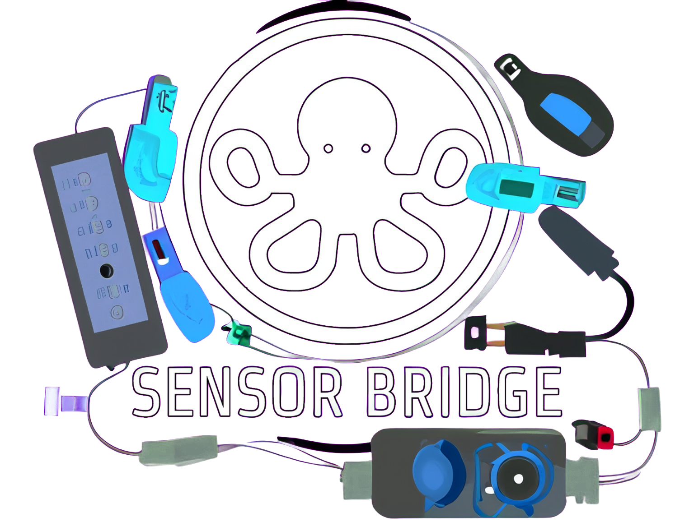
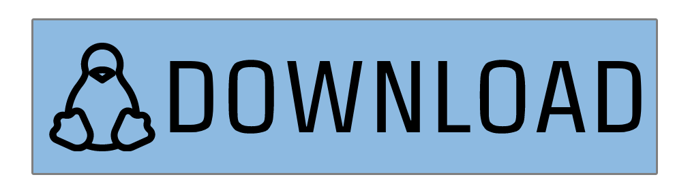
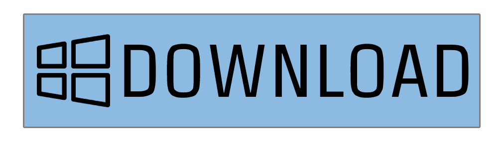
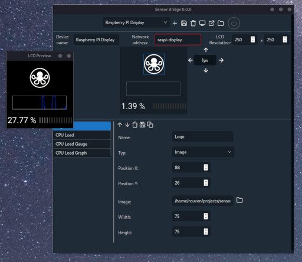
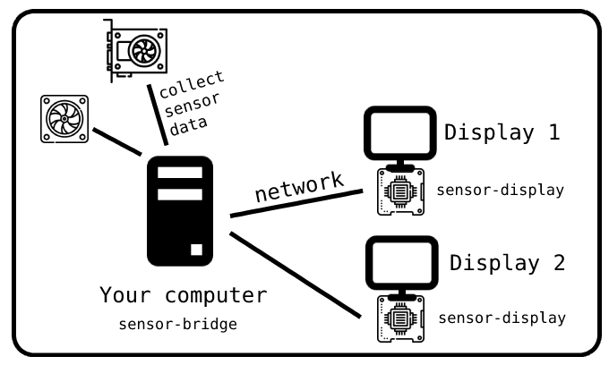

<p align="center">
    
</p>

<p align="center">
    
    
    
</p>

<p align="center">
    <i>Sensor bridge is a cross-platform desktop application that allows you to display sensor information on anothers device screen.</i>
</p>

<p align="center">
    <a id="sensor-bridge-download-linux" href="https://github.com/RouHim/sensor-bridge/releases/download/0.32.38/sensor-bridge_0.32.38_amd64.AppImage"></a>
    <a id="sensor-bridge-download-windows" href="https://github.com/RouHim/sensor-bridge/releases/download/0.32.38/sensor-bridge_0.32.38_x64_en-US.msi"></a>
</p>

## Current state

The software is still in a very early and immature state. If you want to use it, expect bugs.

## Features

* Display sensor information of your computer on another device screen
* Design your display using an intuitive user interface
* Works on Windows and Linux
* Rendering is offloaded to the other device, reducing memory and CPU consumption on your computer
* Supports multiple display devices at the same time
* Custom font support
* Display your data as: Text, Graph or Gauge
* Export and import your designs
* Live preview of your design

## Roadmap

* RTSS support
* Android app
* Aquacomputer aqua suite sensor support
* Local display

## Motivation

Since I recently switched my gaming computer from windows to linux I was desperately looking for a way to display sensor
data (FPS, CPU load, GPU load, etc...) from my computer on a display. On windows I always did this with AIDA64, but
unfortunately it costs money and doesn't run on linux.
So the following problems had to be solved:

* Collect and display sensor data on Linux
* Free and open-source
* Do NOT render the display on the computer (what AIDA64 does) to safe resources
* A user-friendly UI to configure the display

Since I have not found any software that meets all these requirements, I have decided to write it myself.

## Screenshot



## Architecture

For the whole thing to work, you need **two applications**. One is the **sensor-bridge** that runs on your computer and
collects sensor data. In addition, a second computer (can also be a raspberry pi or similar) that has a screen
connected. The **[sensor-display](https://github.com/RouHim/sensor-display)** application runs on this other computer.
This is where the sensor information is sent from your computer and displayed.



## Prerequisites

The following software is required to be installed on your system:

### Windows

* [LibreHardwareMonitor](https://github.com/LibreHardwareMonitor/LibreHardwareMonitor) (`choco install librehardwaremonitor`)

[//]: # (* [RTSS]&#40;https://www.guru3d.com/files-details/rtss-rivatuner-statistics-server-download.html&#41;)

### Linux

* [lm-sensors](https://github.com/lm-sensors/lm-sensors)
* [MangoHud](https://github.com/flightlessmango/MangoHud) (optional) | Make sure
  to [enable stats logging](https://github.com/flightlessmango/MangoHud#fps-logging)

## Build

This section describes how to build and run the project from source.

### Prerequisites

* [Rust](https://www.rust-lang.org/tools/install)
* [Tauri prerequisites](https://tauri.app/v1/guides/getting-started/prerequisites)
* clang
    * On
      Windows: [Enable the "C++ Clang tools for Windows" component in the Visual Studio Installer](https://www.wikihow.com/Install-Clang-on-Windows)
    * On Linux: `sudo apt install clang` or `sudo pacman -S clang` or `sudo dnf install clang`
* lm-sensors dev on linux: `sudo apt install libsensors4-dev` or `sudo pacman -S lm_sensors`
  or `sudo dnf install lm_sensors`

### Debug run

For running the project, run the following command in the root directory of the project:

```bash
cargo tauri dev
```

### Build

For building a release version, run the following command in the root directory of the project:

```bash
cargo tauri build
```

#### Debug version

In order to build a debuggable version of a release build follow this steps:

* Add this feature to the tauri crate in the Cargo.toml: `devtools`
* Build a debug release version with: `cargo tauri build --debug`
* Enable debug logging with: `RUST_LOG=debug`
