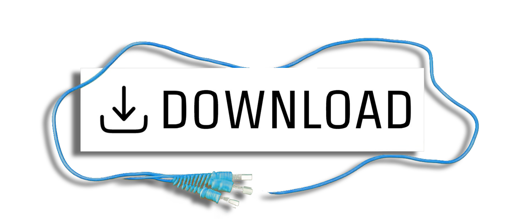

<p align="center">
    
</p>

<p align="center">
    
    
    
</p>

<p align="center">
    <i>Sensor bridge is a cross-platform desktop application that allows you to display sensor information on anothers device screen.</i>
</p>

<p align="center">
    <a href="https://github.com/RouHim/sensor-bridge/releases/latest">
        
    </a>
</p>

## Features

* Display sensor information of your computer on another device screen
* Design your display using an intuitive user interface
* Works on Windows and Linux
* Rendering is offloaded to the other device, reducing memory and CPU consumption on your computer
* Supports display devices at the same time
* Custom fonts
* Display your data as: Text, Graph or Gauge
* Export and import your designs
* Live preview of your design

## Screenshot

TBD

## Prerequisites

The following software is required to be installed on your system:

### Windows

* [LibreHardwareMonitor](https://github.com/LibreHardwareMonitor/LibreHardwareMonitor)

[//]: # (* [RTSS]&#40;https://www.guru3d.com/files-details/rtss-rivatuner-statistics-server-download.html&#41;)

### Linux

* [lm-sensors](https://github.com/lm-sensors/lm-sensors)
* (optional) [MangoHud](https://github.com/flightlessmango/MangoHud) | Make sure
  to [enable stats logging](https://github.com/flightlessmango/MangoHud#fps-logging)

## Build

### Prerequisites

* [Rust](https://www.rust-lang.org/tools/install)
* [Tauri prerequisites](https://tauri.app/v1/guides/getting-started/prerequisites)
* clang
    * On
      Windows: [Enable the "C++ Clang tools for Windows" component in the Visual Studio Installer](https://www.wikihow.com/Install-Clang-on-Windows)
    * On Linux: `sudo apt install clang` or `sudo pacman -S clang` or `sudo dnf install clang`
* lm-sensors dev on linux: `sudo apt install libsensors4-dev` or `sudo pacman -S lm_sensors`
  or `sudo dnf install lm_sensors`

### Run

For running the project, run the following command in the root directory of the project:

```bash
cargo tauri dev
```

### Build

For building a release version, run the following command in the root directory of the project:

```bash
cargo tauri build
```

#### Debug version

In order to build a debuggable version of a release build follow this steps:

* Add this feature to the tauri crate in the Cargo.toml: `devtools`
* Build a debug release version with: `cargo tauri build --debug`
* Enable debug logging with: `RUST_LOG=debug`